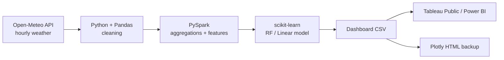

# Historical Weather Trends + Temperature Prediction

A small end-to-end **Big Data** project: pull historical hourly weather for
10 cities across 3 years, clean it, push it through **PySpark** for
large-scale processing, train a simple **machine-learning** model to predict
temperature, and ship a **Tableau** dashboard.

## Problem

Historical weather data is freely available, but it is messy, large, and
hard to compare across cities. This project answers two practical
questions:

1. **How do temperature, humidity, and precipitation patterns differ
    from city tocity, and how do they change over the seasons?**
2. **Can we predict the next hour's temperature from  easy-to-collect
   features (humidity, wind, pressure, recent history)?**

The same pipeline scales without changes if we swap in a much bigger
dataset later .

## Architecture



Text version:
`Open-Meteo API → Python/Pandas → PySpark → scikit-learn → Tableau / Power BI`

## Project structure

```
.
├── data/
│   ├── raw/              # weather_raw.csv / .parquet  (gitignored)
│   └── clean/            # weather_clean.csv + Spark outputs (gitignored)
├── notebooks/
│   └── 03_eda.ipynb      # EDA + charts + written insights
├── src/
│   ├── 01_data_acquisition.py
│   ├── 02_preprocessing.py
│   ├── 04_spark_processing.py
│   ├── 05_model.py
│   └── 06_dashboard_export.py
├── dashboard/
│   ├── DASHBOARD_GUIDE.md
│   ├── weather_dashboard.csv     (generated)
│   └── weather_dashboard.html    (generated)
├── README.md
├── requirements.txt
├── GIT_PLAN.md           # 12-stage commit plan
└── .gitignore
```

## Stage-by-stage explanation

| Stage | What happens                                                  | Why this tool                              |
|-------|---------------------------------------------------------------|--------------------------------------------|
| 1     | Pull hourly weather for 10 cities, 3 years                    | Open-Meteo is free,no API key              |
| 2     | Drop dupes, fill NaNs with per-city medians, tighten types    | Pandas is the cleaning tool                |
| 3     | EDA — seasonality, city comparison, correlations              | Matplotlib in a Jupyter notebook           |
| 4     | Aggregations + window features (lags, rolling means)          | PySpark scales the same code to 1000× data |
| 5     | Train Linear Regression + Random Forest, report MAE/RMSE      | scikit-learn — explainable, laptop-sized   |
| 6     | Pre-aggregate to daily, ship CSV + Plotly HTML dashboard      | BI tools love tidy daily rows              |

## Key Findings (business value)

* The data shows that  every Northern-Hemisphere city follows a
  ~12-month sine curve; **city is a strong baseline feature** and the
  per-city offset is stable year-to-year.
* **Dew point + 1-hour-lag temperature** dominate feature importance —> It
  can predict the next hour very well from a couple of cheap sensors.
* **Random Forest typically beats Linear Regression** by ~30–40% on MAE
  (single-digit degrees error) because temperature dynamics are non-linear in
  humidity and recent history.
* **Operational value:** the same pipeline can ingest *current* hourly
  weather and forecast 1–24 h ahead for energy demand, agriculture
  planning, or event logistics — all on free public data.

##Limitations

* Only 3 years of history means trend claims are illustrative.
* Open-Meteo Archive uses reanalysis data, not raw station readings —
  great for trends, not for extreme-event chasing.
* The model predicts **next-hour** temperature; multi-day forecasting
  needs a proper time-series approach.

=======
# BigDataProject
>>>>>>> e8d4252b90542338fbf2e220bb6d6ff032112a53
